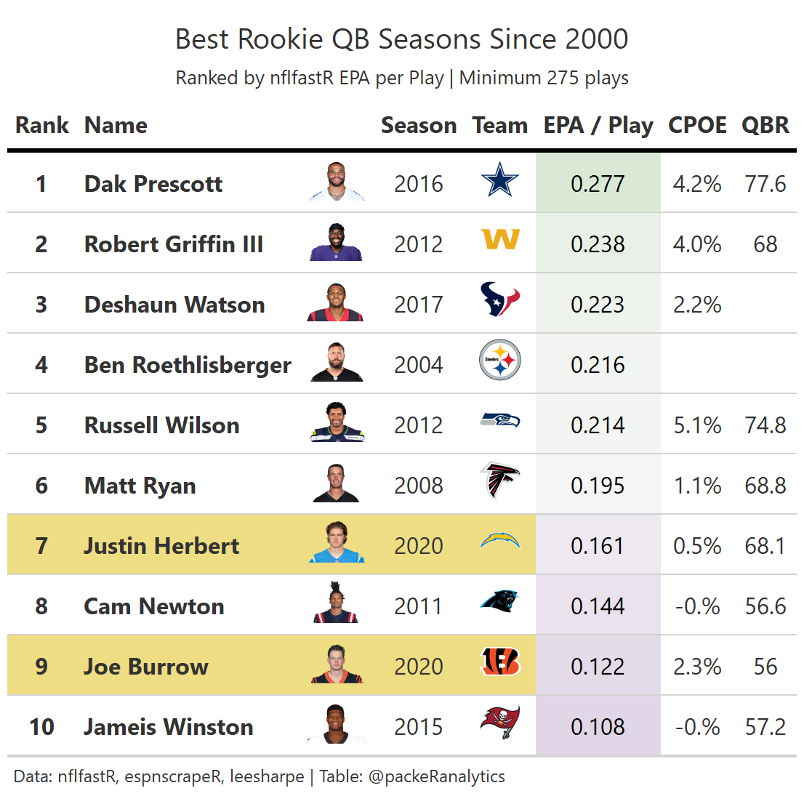

```{r setup, include=FALSE}
knitr::opts_chunk$set(
  echo = TRUE,
  message = FALSE,
  warning = FALSE,
  dpi = 300,
  tidy = 'styler')
```

## Introduction
This guide will show you how to make tables like this one.
![Table 1.]ex_png.png)

The following assumes you have some familiarity with nflfastR. If you don't but are interested in learning more I recommend starting with [Ben Baldwin's nflfastR begginer's guide](https://www.nflfastr.com/articles/beginners_guide.html) or [Lee Sharpe's R and RStudio Intro](https://github.com/leesharpe/nfldata/blob/master/RSTUDIO-INTRO.md#r-and-rstudio-introduction).

Also, 99% of what I know about creating tables in R is from [Thomas Mock's 10 Guidelines](https://themockup.blog/posts/2020-09-04-10-table-rules-in-r/) and [another Mock blog post](https://themockup.blog/posts/2020-10-11-embedding-images-in-ggplot/#what-about-a-table).

## Data wrangling
The wonderful Lee Sharpe has draft pick data from 2000 available [here](https://github.com/leesharpe/nfldata/blob/master/DATASETS.md#draft_picks). 
```{r}
# Read in draft data from Lee's github
library(tidyverse)

  draft_picks <- read_csv(
    url(
      glue::glue('https://raw.githubusercontent.com/leesharpe/nfldata/master/data/draft_picks.csv'))) %>% 
    filter(position == "QB") %>% 
    rename(rookie_szn = season)
```

We are going to use the name field to join with nflfastR  & QBR data later. Lee's data has RGIII as "R.Griffin" and nflfastR has "R.Griffin III". Let's change RGIII in draft_picks.
```{r}
# Rename RGIII in Lee's data to later join with pbp data  
  draft_picks$name[draft_picks$name == "R.Griffin"] <- "R.Griffin III"
```

Now let's get the play-by-play data from nflfastR. 
```{r}
seasons <- 2000:2020
pbp <- purrr::map_df(seasons, function(x) {
  readRDS(
    url(
      glue::glue("https://raw.githubusercontent.com/guga31bb/nflfastR-data/master/data/play_by_play_{x}.rds")
    )
  ) %>% 
    filter(!is.na(name) & !is.na(down) & (pass == 1 | rush == 1) & !is.na(epa) & week <= 17) %>% 
    select(id, name, posteam, season, pass, qb_epa, cpoe)
})
```

Great! We have draft pick data and play-by-play data going back to the year 2000 season. Now let's aggregate statistics by qb and season.
```{r}
# Summarize seasons from nflfastR
  pbp <- pbp %>% 
    group_by(id, name, season) %>% 
    summarize(
      posteam = last(posteam),
      n = n(),
      n_pass = sum(pass),
      qb_epa = mean(qb_epa, na.rm = T),
      cpoe = mean(cpoe, na.rm = T),
      .groups = 'drop'
    ) %>% 
  # Set threshold for minimum number of plays to qualify
    filter(n >= 275) %>% 
    arrange(-qb_epa) %>% 
  # Join with team colors and logos data
    dplyr::left_join(
      nflfastR::teams_colors_logos %>% select(team_abbr, team_logo_espn),
      by = c("posteam" = "team_abbr")
    ) 
```
```{r}
# Add space between first initial and last name to join with QBR dataset later
  pbp <- pbp %>% 
    mutate(
      qbr_name = paste(substr(name, 1, 2), substr(name, 3, nchar(name)))
    ) 
```

Let's bring in QBR data from espnscrapeR which also contains links to qb headshot urls. Note QBR does not exist prior to 2006.
```{r}
# Get QBR data
  szns <- 2006:2020
  
# Create empty character vector
  qbr_data <- c()
  
# Scrape QBR seasons
  for(szn in szns) {
    tmp <- espnscrapeR::get_nfl_qbr(szn)
    qbr_data <- rbind(qbr_data, tmp)
  }
  
# Rename qbr data name
  qbr_data <- qbr_data  %>% 
    rename(long_name = name)

# Get rid of stuff
  rm(tmp, szn, szns, seasons)
```

## Merge data sources
Okay we have pbp which contains summarized quarterback seasons, draft_picks which tells us what year players were drafted, and qbr_data which contains links to the headshot urls. Now let's bring it all together
```{r}
# Merge nflfastR & QBR totals
  df <- merge(pbp, qbr_data %>% 
                filter(season_type == "Regular") %>% 
                select(short_name, season, qbr_total),
              by.x = c("qbr_name", "season"),
              by.y = c("short_name", "season"),
              all.x = T) %>% 
    arrange(-qb_epa) 
```

```{r}
# Add draft info to summarized seasons and store in df
df <- merge(df, draft_picks %>%  select(name, rookie_szn, team, round, pick),
            by.x = c("name"),
            by.y = c("name"),
            all.x = T) %>% 
    mutate(
      rk_yr = if_else(season == rookie_szn, 1, 0))

# Filter to rookie seasons only and rank by epa per play
  df <- df %>% 
    filter(rk_yr == 1) %>% 
    arrange(-qb_epa) %>% 
    mutate(rank = row_number())
```

```{r}
# Create table for qb headshots
  qb_href <- qbr_data %>% 
    distinct(short_name, long_name, headshot_href)
  
# Merge qb headshots
  df <- merge(df, qb_href,
              by.x = "qbr_name",
              by.y = "short_name",
              all.x = T) %>% 
    arrange(-qb_epa) %>% 
    mutate(rank = row_number()) %>% 
    select(
      rank,
      long_name,
      headshot_href,
      season,
      team_logo_espn,
      qb_epa,
      cpoe,
      qbr_total
    ) %>% 
    mutate(
      cpoe = paste0(substr(cpoe, 1, 3), "%"),
      qbr_total = round(qbr_total, 2))
```

GT doesn't like NAs and we don't have QBR data for seasons prior to 2006 or for seasons with a low number of attempts. Let's replace NAs with blank spaces. 
```{r}
  df[is.na(df)] <- ""
  df$cpoe[df$cpoe == "NaN%"] <- ""
```

## Make a table
```{r}
library(gt)
link_to_img <- function(x, width = 50) {
    glue::glue("")
  }
  
  tbl <- df %>% 
    filter(rank <=10) %>% 
    gt() %>% 
    tab_header(
      title = "Best Rookie QB Seasons Since 2000",
      subtitle = "Ranked by nflfastR EPA per Play | Minimum 275 plays"
    ) %>% 
    tab_source_note("Data: nflfastR, espnscrapeR, leesharpe  | Table: @packeRanalytics") %>% 
    cols_label(
      rank = "Rank",
      long_name = "Name",
      headshot_href = "",
      season = "Season",
      team_logo_espn = "Team",
      qb_epa = "EPA / Play",
      cpoe = "CPOE",
      qbr_total = "QBR"
    ) %>% 
    fmt_number(columns = vars(qb_epa), decimals = 3) %>% 
    data_color(
      columns = vars(qb_epa),
      colors = scales::col_numeric(
        palette = c("#af8dc3", "#f7f7f7", "#7fbf7b"),
        domain = c(-.1, .5)
      )
    ) %>% 
    tab_style(
      style = cell_fill(color = "#eedd82"),
      locations = cells_body(
        columns = vars(rank, long_name, headshot_href, season, team_logo_espn),
        rows = season == 2020
      )
    ) %>% 
    tab_style(
      style = cell_text(weight = "bold"),
      locations = cells_body(
        columns = vars(rank, long_name)
      )
    ) %>% 
    text_transform(
      locations = cells_body(vars(team_logo_espn)),
      fn = function(x) web_image(url = x)
    ) %>% 
    text_transform(
      locations = cells_body(vars(headshot_href)),
      fn = function(x) web_image(url = x)
    ) %>% 
    tab_options(
      column_labels.background.color = "white",
      column_labels.font.weight = "bold",
      table.border.top.width = px(3),
      table.border.top.color = "transparent",
      table.border.bottom.color = "transparent",
      table.border.bottom.width = px(3),
      column_labels.border.top.width = px(3),
      column_labels.border.top.color = "transparent",
      column_labels.border.bottom.width = px(3),
      column_labels.border.bottom.color = "black",
      data_row.padding = px(3),
      source_notes.font.size = 12,
      table.font.size = 16,
      heading.title.font.weight = "bold") %>%
    opt_table_font(
      font = list(
        google_font("Chivo"),
        default_fonts()
      )
    ) %>% 
    cols_align(align = "center",
               columns = vars(team_logo_espn, qb_epa, cpoe, qbr_total))
  
```
```{r}
# Save table as png
  gtsave(tbl, filename = "best_rookie_QB_szns.png")
```


