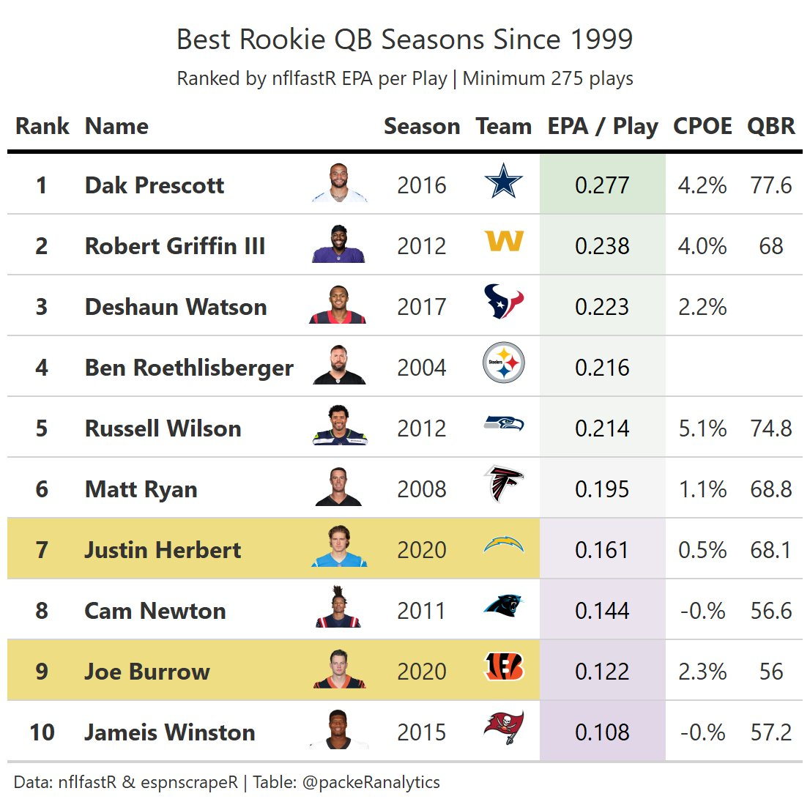

## Introduction
This guide will show you how to make tables like this one.


The following assumes you have some familiarity with nflfastR. If you don't but are interested in learning more I recommend starting with [Ben Baldwin's nflfastR begginer's guide](https://www.nflfastr.com/articles/beginners_guide.html) or [Lee Sharpe's R and RStudio Intro](https://github.com/leesharpe/nfldata/blob/master/RSTUDIO-INTRO.md#r-and-rstudio-introduction).

Also, 99% of what I know about creating tables in R is from [Thomas Mock's 10 Guidelines](https://themockup.blog/posts/2020-09-04-10-table-rules-in-r/) and [another Mock blog post](https://themockup.blog/posts/2020-10-11-embedding-images-in-ggplot/#what-about-a-table).

## Data wrangling
The wonderful Lee Sharpe has draft pick data from 2000 available [here](https://github.com/leesharpe/nfldata/blob/master/DATASETS.md#draft_picks). 

```r
# Read in draft data from Lee's github
library(tidyverse)

  draft_picks <- read_csv(
    url(
      glue::glue('https://raw.githubusercontent.com/leesharpe/nfldata/master/data/draft_picks.csv'))) %>% 
    filter(position == "QB") %>% 
    rename(rookie_szn = season)
```

We are going to use the name field to join with nflfastR  & QBR data later. Lee's data has RGIII as "R.Griffin" and nflfastR has "R.Griffin III". Let's change RGIII in draft_picks.

```r
# Rename RGIII in Lee's data to later join with pbp data  
  draft_picks$name[draft_picks$name == "R.Griffin"] <- "R.Griffin III"
```

Now let's get the play-by-play data from nflfastR. 

```r
seasons <- 2000:2020
pbp <- purrr::map_df(seasons, function(x) {
  readRDS(
    url(
      glue::glue("https://raw.githubusercontent.com/guga31bb/nflfastR-data/master/data/play_by_play_{x}.rds")
    )
  ) %>% 
    filter(!is.na(name) & !is.na(down) & (pass == 1 | rush == 1) & !is.na(epa) & week <= 17) %>% 
    select(id, name, posteam, season, pass, qb_epa, cpoe)
})
```

Great! We have draft pick data and play-by-play data going back to the year 2000 season. Now let's aggregate statistics by qb and season.


```r
# Summarize seasons from nflfastR
  pbp <- pbp %>% 
    group_by(id, name, season) %>% 
    summarize(
      posteam = last(posteam),
      n = n(),
      n_pass = sum(pass),
      qb_epa = mean(qb_epa, na.rm = T),
      cpoe = mean(cpoe, na.rm = T),
      .groups = 'drop'
    ) %>% 
  # Set threshold for minimum number of plays to qualify
    filter(n >= 275) %>% 
    arrange(-qb_epa) %>% 
  # Join with team colors and logos data
    dplyr::left_join(
      nflfastR::teams_colors_logos %>% select(team_abbr, team_logo_espn),
      by = c("posteam" = "team_abbr")
    ) 
```

```r
# Add space between first initial and last name to join with QBR dataset later
  pbp <- pbp %>% 
    mutate(
      qbr_name = paste(substr(name, 1, 2), substr(name, 3, nchar(name)))
    ) 
```


Let's bring in QBR data from espnscrapeR which also contains links to qb headshot urls. Note QBR does not exist prior to 2006.

```r
# Get QBR data
  szns <- 2006:2020
  
# Create empty character vector
  qbr_data <- c()
  
# Scrape QBR seasons
  for(szn in szns) {
    tmp <- espnscrapeR::get_nfl_qbr(szn)
    qbr_data <- rbind(qbr_data, tmp)
  }
  
# Rename qbr data name
  qbr_data <- qbr_data  %>% 
    rename(long_name = name)

# Get rid of stuff
  rm(tmp, szn, szns, seasons)
```

## Merge data sources
Okay we have pbp which contains summarized quarterback seasons, draft_picks which tells us what year players were drafted, and qbr_data which contains links to the headshot urls. Now let's bring it all together

```r
# Merge nflfastR & QBR totals
  df <- merge(pbp, qbr_data %>% 
                filter(season_type == "Regular") %>% 
                select(short_name, season, qbr_total),
              by.x = c("qbr_name", "season"),
              by.y = c("short_name", "season"),
              all.x = T) %>% 
    arrange(-qb_epa) 
```


```r
# Add draft info to summarized seasons and store in df
df <- merge(df, draft_picks %>%  select(name, rookie_szn, team, round, pick),
            by.x = c("name"),
            by.y = c("name"),
            all.x = T) %>% 
    mutate(
      rk_yr = if_else(season == rookie_szn, 1, 0))

# Filter to rookie seasons only and rank by epa per play
  df <- df %>% 
    filter(rk_yr == 1) %>% 
    arrange(-qb_epa) %>% 
    mutate(rank = row_number())
```


```r
# Create table for qb headshots
  qb_href <- qbr_data %>% 
    distinct(short_name, long_name, headshot_href)
  
# Merge qb headshots
  df <- merge(df, qb_href,
              by.x = "qbr_name",
              by.y = "short_name",
              all.x = T) %>% 
    arrange(-qb_epa) %>% 
    mutate(rank = row_number()) %>% 
    select(
      rank,
      long_name,
      headshot_href,
      season,
      team_logo_espn,
      qb_epa,
      cpoe,
      qbr_total
    ) %>% 
    mutate(
      cpoe = paste0(substr(cpoe, 1, 3), "%"),
      qbr_total = round(qbr_total, 2))
```


```r
# Does it look right?
  head(df, 10)
```

```
##    rank          long_name
## 1     1       Dak Prescott
## 2     2 Robert Griffin III
## 3     3     Deshaun Watson
## 4     4 Ben Roethlisberger
## 5     5     Russell Wilson
## 6     6          Matt Ryan
## 7     7     Justin Herbert
## 8     8         Cam Newton
## 9     9         Joe Burrow
## 10   10     Jameis Winston
##                                                     headshot_href season
## 1  https://a.espncdn.com/i/headshots/nfl/players/full/2577417.png   2016
## 2    https://a.espncdn.com/i/headshots/nfl/players/full/14875.png   2012
## 3  https://a.espncdn.com/i/headshots/nfl/players/full/3122840.png   2017
## 4     https://a.espncdn.com/i/headshots/nfl/players/full/5536.png   2004
## 5    https://a.espncdn.com/i/headshots/nfl/players/full/14881.png   2012
## 6    https://a.espncdn.com/i/headshots/nfl/players/full/11237.png   2008
## 7  https://a.espncdn.com/i/headshots/nfl/players/full/4038941.png   2020
## 8    https://a.espncdn.com/i/headshots/nfl/players/full/13994.png   2011
## 9  https://a.espncdn.com/i/headshots/nfl/players/full/3915511.png   2020
## 10 https://a.espncdn.com/i/headshots/nfl/players/full/2969939.png   2015
##                                            team_logo_espn    qb_epa cpoe
## 1       https://a.espncdn.com/i/teamlogos/nfl/500/dal.png 0.2768876 4.2%
## 2       https://a.espncdn.com/i/teamlogos/nfl/500/wsh.png 0.2380083 4.0%
## 3       https://a.espncdn.com/i/teamlogos/nfl/500/hou.png 0.2227679 2.2%
## 4       https://a.espncdn.com/i/teamlogos/nfl/500/pit.png 0.2155673 NaN%
## 5       https://a.espncdn.com/i/teamlogos/nfl/500/sea.png 0.2136384 5.1%
## 6       https://a.espncdn.com/i/teamlogos/nfl/500/atl.png 0.1946260 1.1%
## 7       https://a.espncdn.com/i/teamlogos/nfl/500/lac.png 0.1610119 0.5%
## 8  https://a.espncdn.com/i/teamlogos/nfl/500-dark/car.png 0.1444727 -0.%
## 9       https://a.espncdn.com/i/teamlogos/nfl/500/cin.png 0.1220035 2.3%
## 10       https://a.espncdn.com/i/teamlogos/nfl/500/tb.png 0.1081903 -0.%
##    qbr_total
## 1       77.6
## 2       68.0
## 3         NA
## 4         NA
## 5       74.8
## 6       68.8
## 7       68.1
## 8       56.6
## 9       56.0
## 10      57.2
```
GT doesn't like NAs and we don't have QBR data for seasons prior to 2006 or for seasons with a low number of attempts. Let's replace NAs with blank spaces. 

```r
  df[is.na(df)] <- ""
  df$cpoe[df$cpoe == "NaN%"] <- ""
```

## Make a table

```r
library(gt)
link_to_img <- function(x, width = 50) {
    glue::glue("")
  }
  
  tbl <- df %>% 
    mutate(rank = row_number()) %>% 
    filter(rank <=10) %>% 
    gt() %>% 
    tab_header(
      title = "Best Rookie QB Seasons Since 2000",
      subtitle = "Ranked by nflfastR EPA per Play | Minimum 275 plays"
    ) %>% 
    tab_source_note("Data: nflfastR, espnscrapeR, leesharpe  | Table: @packeRanalytics") %>% 
    cols_label(
      rank = "Rank",
      long_name = "Name",
      headshot_href = "",
      season = "Season",
      team_logo_espn = "Team",
      qb_epa = "EPA / Play",
      cpoe = "CPOE",
      qbr_total = "QBR"
    ) %>% 
    fmt_number(columns = vars(qb_epa), decimals = 3) %>% 
    data_color(
      columns = vars(qb_epa),
      colors = scales::col_numeric(
        palette = c("#af8dc3", "#f7f7f7", "#7fbf7b"),
        domain = c(-.1, .5)
      )
    ) %>% 
    tab_style(
      style = cell_fill(color = "#eedd82"),
      locations = cells_body(
        columns = vars(rank, long_name, headshot_href, season, team_logo_espn),
        rows = season == 2020
      )
    ) %>% 
    tab_style(
      style = cell_text(weight = "bold"),
      locations = cells_body(
        columns = vars(rank, long_name)
      )
    ) %>% 
    text_transform(
      locations = cells_body(vars(team_logo_espn)),
      fn = function(x) web_image(url = x)
    ) %>% 
    text_transform(
      locations = cells_body(vars(headshot_href)),
      fn = function(x) web_image(url = x)
    ) %>% 
    tab_options(
      column_labels.background.color = "white",
      column_labels.font.weight = "bold",
      table.border.top.width = px(3),
      table.border.top.color = "transparent",
      table.border.bottom.color = "transparent",
      table.border.bottom.width = px(3),
      column_labels.border.top.width = px(3),
      column_labels.border.top.color = "transparent",
      column_labels.border.bottom.width = px(3),
      column_labels.border.bottom.color = "black",
      data_row.padding = px(3),
      source_notes.font.size = 12,
      table.font.size = 16,
      heading.title.font.weight = "bold") %>%
    opt_table_font(
      font = list(
        google_font("Chivo"),
        default_fonts()
      )
    ) %>% 
    cols_align(align = "center",
               columns = vars(team_logo_espn, qb_epa, cpoe, qbr_total))
  
  tbl
```

<!--html_preserve--><style>@import url("https://fonts.googleapis.com/css2?family=Chivo:ital,wght@0,100;0,200;0,300;0,400;0,500;0,600;0,700;0,800;0,900;1,100;1,200;1,300;1,400;1,500;1,600;1,700;1,800;1,900&display=swap");
html {
  font-family: Chivo, -apple-system, BlinkMacSystemFont, 'Segoe UI', Roboto, Oxygen, Ubuntu, Cantarell, 'Helvetica Neue', 'Fira Sans', 'Droid Sans', Arial, sans-serif;
}

#xxpwdhyqss .gt_table {
  display: table;
  border-collapse: collapse;
  margin-left: auto;
  margin-right: auto;
  color: #333333;
  font-size: 16px;
  font-weight: normal;
  font-style: normal;
  background-color: #FFFFFF;
  width: auto;
  border-top-style: solid;
  border-top-width: 3px;
  border-top-color: transparent;
  border-right-style: none;
  border-right-width: 2px;
  border-right-color: #D3D3D3;
  border-bottom-style: solid;
  border-bottom-width: 3px;
  border-bottom-color: transparent;
  border-left-style: none;
  border-left-width: 2px;
  border-left-color: #D3D3D3;
}

#xxpwdhyqss .gt_heading {
  background-color: #FFFFFF;
  text-align: center;
  border-bottom-color: #FFFFFF;
  border-left-style: none;
  border-left-width: 1px;
  border-left-color: #D3D3D3;
  border-right-style: none;
  border-right-width: 1px;
  border-right-color: #D3D3D3;
}

#xxpwdhyqss .gt_title {
  color: #333333;
  font-size: 125%;
  font-weight: bold;
  padding-top: 4px;
  padding-bottom: 4px;
  border-bottom-color: #FFFFFF;
  border-bottom-width: 0;
}

#xxpwdhyqss .gt_subtitle {
  color: #333333;
  font-size: 85%;
  font-weight: initial;
  padding-top: 0;
  padding-bottom: 4px;
  border-top-color: #FFFFFF;
  border-top-width: 0;
}

#xxpwdhyqss .gt_bottom_border {
  border-bottom-style: solid;
  border-bottom-width: 2px;
  border-bottom-color: #D3D3D3;
}

#xxpwdhyqss .gt_col_headings {
  border-top-style: solid;
  border-top-width: 3px;
  border-top-color: transparent;
  border-bottom-style: solid;
  border-bottom-width: 3px;
  border-bottom-color: black;
  border-left-style: none;
  border-left-width: 1px;
  border-left-color: #D3D3D3;
  border-right-style: none;
  border-right-width: 1px;
  border-right-color: #D3D3D3;
}

#xxpwdhyqss .gt_col_heading {
  color: #333333;
  background-color: white;
  font-size: 100%;
  font-weight: bold;
  text-transform: inherit;
  border-left-style: none;
  border-left-width: 1px;
  border-left-color: #D3D3D3;
  border-right-style: none;
  border-right-width: 1px;
  border-right-color: #D3D3D3;
  vertical-align: bottom;
  padding-top: 5px;
  padding-bottom: 6px;
  padding-left: 5px;
  padding-right: 5px;
  overflow-x: hidden;
}

#xxpwdhyqss .gt_column_spanner_outer {
  color: #333333;
  background-color: white;
  font-size: 100%;
  font-weight: bold;
  text-transform: inherit;
  padding-top: 0;
  padding-bottom: 0;
  padding-left: 4px;
  padding-right: 4px;
}

#xxpwdhyqss .gt_column_spanner_outer:first-child {
  padding-left: 0;
}

#xxpwdhyqss .gt_column_spanner_outer:last-child {
  padding-right: 0;
}

#xxpwdhyqss .gt_column_spanner {
  border-bottom-style: solid;
  border-bottom-width: 3px;
  border-bottom-color: black;
  vertical-align: bottom;
  padding-top: 5px;
  padding-bottom: 6px;
  overflow-x: hidden;
  display: inline-block;
  width: 100%;
}

#xxpwdhyqss .gt_group_heading {
  padding: 8px;
  color: #333333;
  background-color: #FFFFFF;
  font-size: 100%;
  font-weight: initial;
  text-transform: inherit;
  border-top-style: solid;
  border-top-width: 2px;
  border-top-color: #D3D3D3;
  border-bottom-style: solid;
  border-bottom-width: 2px;
  border-bottom-color: #D3D3D3;
  border-left-style: none;
  border-left-width: 1px;
  border-left-color: #D3D3D3;
  border-right-style: none;
  border-right-width: 1px;
  border-right-color: #D3D3D3;
  vertical-align: middle;
}

#xxpwdhyqss .gt_empty_group_heading {
  padding: 0.5px;
  color: #333333;
  background-color: #FFFFFF;
  font-size: 100%;
  font-weight: initial;
  border-top-style: solid;
  border-top-width: 2px;
  border-top-color: #D3D3D3;
  border-bottom-style: solid;
  border-bottom-width: 2px;
  border-bottom-color: #D3D3D3;
  vertical-align: middle;
}

#xxpwdhyqss .gt_from_md > :first-child {
  margin-top: 0;
}

#xxpwdhyqss .gt_from_md > :last-child {
  margin-bottom: 0;
}

#xxpwdhyqss .gt_row {
  padding-top: 3px;
  padding-bottom: 3px;
  padding-left: 5px;
  padding-right: 5px;
  margin: 10px;
  border-top-style: solid;
  border-top-width: 1px;
  border-top-color: #D3D3D3;
  border-left-style: none;
  border-left-width: 1px;
  border-left-color: #D3D3D3;
  border-right-style: none;
  border-right-width: 1px;
  border-right-color: #D3D3D3;
  vertical-align: middle;
  overflow-x: hidden;
}

#xxpwdhyqss .gt_stub {
  color: #333333;
  background-color: #FFFFFF;
  font-size: 100%;
  font-weight: initial;
  text-transform: inherit;
  border-right-style: solid;
  border-right-width: 2px;
  border-right-color: #D3D3D3;
  padding-left: 12px;
}

#xxpwdhyqss .gt_summary_row {
  color: #333333;
  background-color: #FFFFFF;
  text-transform: inherit;
  padding-top: 8px;
  padding-bottom: 8px;
  padding-left: 5px;
  padding-right: 5px;
}

#xxpwdhyqss .gt_first_summary_row {
  padding-top: 8px;
  padding-bottom: 8px;
  padding-left: 5px;
  padding-right: 5px;
  border-top-style: solid;
  border-top-width: 2px;
  border-top-color: #D3D3D3;
}

#xxpwdhyqss .gt_grand_summary_row {
  color: #333333;
  background-color: #FFFFFF;
  text-transform: inherit;
  padding-top: 8px;
  padding-bottom: 8px;
  padding-left: 5px;
  padding-right: 5px;
}

#xxpwdhyqss .gt_first_grand_summary_row {
  padding-top: 8px;
  padding-bottom: 8px;
  padding-left: 5px;
  padding-right: 5px;
  border-top-style: double;
  border-top-width: 6px;
  border-top-color: #D3D3D3;
}

#xxpwdhyqss .gt_striped {
  background-color: rgba(128, 128, 128, 0.05);
}

#xxpwdhyqss .gt_table_body {
  border-top-style: solid;
  border-top-width: 2px;
  border-top-color: #D3D3D3;
  border-bottom-style: solid;
  border-bottom-width: 2px;
  border-bottom-color: #D3D3D3;
}

#xxpwdhyqss .gt_footnotes {
  color: #333333;
  background-color: #FFFFFF;
  border-bottom-style: none;
  border-bottom-width: 2px;
  border-bottom-color: #D3D3D3;
  border-left-style: none;
  border-left-width: 2px;
  border-left-color: #D3D3D3;
  border-right-style: none;
  border-right-width: 2px;
  border-right-color: #D3D3D3;
}

#xxpwdhyqss .gt_footnote {
  margin: 0px;
  font-size: 90%;
  padding: 4px;
}

#xxpwdhyqss .gt_sourcenotes {
  color: #333333;
  background-color: #FFFFFF;
  border-bottom-style: none;
  border-bottom-width: 2px;
  border-bottom-color: #D3D3D3;
  border-left-style: none;
  border-left-width: 2px;
  border-left-color: #D3D3D3;
  border-right-style: none;
  border-right-width: 2px;
  border-right-color: #D3D3D3;
}

#xxpwdhyqss .gt_sourcenote {
  font-size: 12px;
  padding: 4px;
}

#xxpwdhyqss .gt_left {
  text-align: left;
}

#xxpwdhyqss .gt_center {
  text-align: center;
}

#xxpwdhyqss .gt_right {
  text-align: right;
  font-variant-numeric: tabular-nums;
}

#xxpwdhyqss .gt_font_normal {
  font-weight: normal;
}

#xxpwdhyqss .gt_font_bold {
  font-weight: bold;
}

#xxpwdhyqss .gt_font_italic {
  font-style: italic;
}

#xxpwdhyqss .gt_super {
  font-size: 65%;
}

#xxpwdhyqss .gt_footnote_marks {
  font-style: italic;
  font-size: 65%;
}
</style>
<div id="xxpwdhyqss" style="overflow-x:auto;overflow-y:auto;width:auto;height:auto;"><table class="gt_table">
  <thead class="gt_header">
    <tr>
      <th colspan="8" class="gt_heading gt_title gt_font_normal" style>Best Rookie QB Seasons Since 2000</th>
    </tr>
    <tr>
      <th colspan="8" class="gt_heading gt_subtitle gt_font_normal gt_bottom_border" style>Ranked by nflfastR EPA per Play | Minimum 275 plays</th>
    </tr>
  </thead>
  <thead class="gt_col_headings">
    <tr>
      <th class="gt_col_heading gt_columns_bottom_border gt_center" rowspan="1" colspan="1">Rank</th>
      <th class="gt_col_heading gt_columns_bottom_border gt_left" rowspan="1" colspan="1">Name</th>
      <th class="gt_col_heading gt_columns_bottom_border gt_left" rowspan="1" colspan="1"></th>
      <th class="gt_col_heading gt_columns_bottom_border gt_center" rowspan="1" colspan="1">Season</th>
      <th class="gt_col_heading gt_columns_bottom_border gt_center" rowspan="1" colspan="1">Team</th>
      <th class="gt_col_heading gt_columns_bottom_border gt_center" rowspan="1" colspan="1">EPA / Play</th>
      <th class="gt_col_heading gt_columns_bottom_border gt_center" rowspan="1" colspan="1">CPOE</th>
      <th class="gt_col_heading gt_columns_bottom_border gt_center" rowspan="1" colspan="1">QBR</th>
    </tr>
  </thead>
  <tbody class="gt_table_body">
    <tr>
      <td class="gt_row gt_center" style="font-weight: bold;">1</td>
      <td class="gt_row gt_left" style="font-weight: bold;">Dak Prescott</td>
      <td class="gt_row gt_left"></td>
      <td class="gt_row gt_center">2016</td>
      <td class="gt_row gt_center"></td>
      <td class="gt_row gt_center" style="background-color: #D9E9D6; color: #000000;">0.277</td>
      <td class="gt_row gt_center">4.2%</td>
      <td class="gt_row gt_center">77.6</td>
    </tr>
    <tr>
      <td class="gt_row gt_center" style="font-weight: bold;">2</td>
      <td class="gt_row gt_left" style="font-weight: bold;">Robert Griffin III</td>
      <td class="gt_row gt_left"></td>
      <td class="gt_row gt_center">2012</td>
      <td class="gt_row gt_center"></td>
      <td class="gt_row gt_center" style="background-color: #E8F0E7; color: #000000;">0.238</td>
      <td class="gt_row gt_center">4.0%</td>
      <td class="gt_row gt_center">68</td>
    </tr>
    <tr>
      <td class="gt_row gt_center" style="font-weight: bold;">3</td>
      <td class="gt_row gt_left" style="font-weight: bold;">Deshaun Watson</td>
      <td class="gt_row gt_left"></td>
      <td class="gt_row gt_center">2017</td>
      <td class="gt_row gt_center"></td>
      <td class="gt_row gt_center" style="background-color: #EEF3ED; color: #000000;">0.223</td>
      <td class="gt_row gt_center">2.2%</td>
      <td class="gt_row gt_center"></td>
    </tr>
    <tr>
      <td class="gt_row gt_center" style="font-weight: bold;">4</td>
      <td class="gt_row gt_left" style="font-weight: bold;">Ben Roethlisberger</td>
      <td class="gt_row gt_left"></td>
      <td class="gt_row gt_center">2004</td>
      <td class="gt_row gt_center"></td>
      <td class="gt_row gt_center" style="background-color: #F1F4F0; color: #000000;">0.216</td>
      <td class="gt_row gt_center"></td>
      <td class="gt_row gt_center"></td>
    </tr>
    <tr>
      <td class="gt_row gt_center" style="font-weight: bold;">5</td>
      <td class="gt_row gt_left" style="font-weight: bold;">Russell Wilson</td>
      <td class="gt_row gt_left"></td>
      <td class="gt_row gt_center">2012</td>
      <td class="gt_row gt_center"></td>
      <td class="gt_row gt_center" style="background-color: #F2F5F1; color: #000000;">0.214</td>
      <td class="gt_row gt_center">5.1%</td>
      <td class="gt_row gt_center">74.8</td>
    </tr>
    <tr>
      <td class="gt_row gt_center" style="font-weight: bold;">6</td>
      <td class="gt_row gt_left" style="font-weight: bold;">Matt Ryan</td>
      <td class="gt_row gt_left"></td>
      <td class="gt_row gt_center">2008</td>
      <td class="gt_row gt_center"></td>
      <td class="gt_row gt_center" style="background-color: #F6F5F6; color: #000000;">0.195</td>
      <td class="gt_row gt_center">1.1%</td>
      <td class="gt_row gt_center">68.8</td>
    </tr>
    <tr>
      <td class="gt_row gt_center" style="background-color: #EEDD82; font-weight: bold;">7</td>
      <td class="gt_row gt_left" style="background-color: #EEDD82; font-weight: bold;">Justin Herbert</td>
      <td class="gt_row gt_left" style="background-color: #EEDD82;"></td>
      <td class="gt_row gt_center" style="background-color: #EEDD82;">2020</td>
      <td class="gt_row gt_center" style="background-color: #EEDD82;"></td>
      <td class="gt_row gt_center" style="background-color: #EEE9F0; color: #000000;">0.161</td>
      <td class="gt_row gt_center">0.5%</td>
      <td class="gt_row gt_center">68.1</td>
    </tr>
    <tr>
      <td class="gt_row gt_center" style="font-weight: bold;">8</td>
      <td class="gt_row gt_left" style="font-weight: bold;">Cam Newton</td>
      <td class="gt_row gt_left"></td>
      <td class="gt_row gt_center">2011</td>
      <td class="gt_row gt_center"></td>
      <td class="gt_row gt_center" style="background-color: #EAE3ED; color: #000000;">0.144</td>
      <td class="gt_row gt_center">-0.%</td>
      <td class="gt_row gt_center">56.6</td>
    </tr>
    <tr>
      <td class="gt_row gt_center" style="background-color: #EEDD82; font-weight: bold;">9</td>
      <td class="gt_row gt_left" style="background-color: #EEDD82; font-weight: bold;">Joe Burrow</td>
      <td class="gt_row gt_left" style="background-color: #EEDD82;"></td>
      <td class="gt_row gt_center" style="background-color: #EEDD82;">2020</td>
      <td class="gt_row gt_center" style="background-color: #EEDD82;"></td>
      <td class="gt_row gt_center" style="background-color: #E4DBE9; color: #000000;">0.122</td>
      <td class="gt_row gt_center">2.3%</td>
      <td class="gt_row gt_center">56</td>
    </tr>
    <tr>
      <td class="gt_row gt_center" style="font-weight: bold;">10</td>
      <td class="gt_row gt_left" style="font-weight: bold;">Jameis Winston</td>
      <td class="gt_row gt_left"></td>
      <td class="gt_row gt_center">2015</td>
      <td class="gt_row gt_center"></td>
      <td class="gt_row gt_center" style="background-color: #E1D6E7; color: #000000;">0.108</td>
      <td class="gt_row gt_center">-0.%</td>
      <td class="gt_row gt_center">57.2</td>
    </tr>
  </tbody>
  <tfoot class="gt_sourcenotes">
    <tr>
      <td class="gt_sourcenote" colspan="8">Data: nflfastR, espnscrapeR, leesharpe  | Table: @packeRanalytics</td>
    </tr>
  </tfoot>
  
</table></div><!--/html_preserve-->

